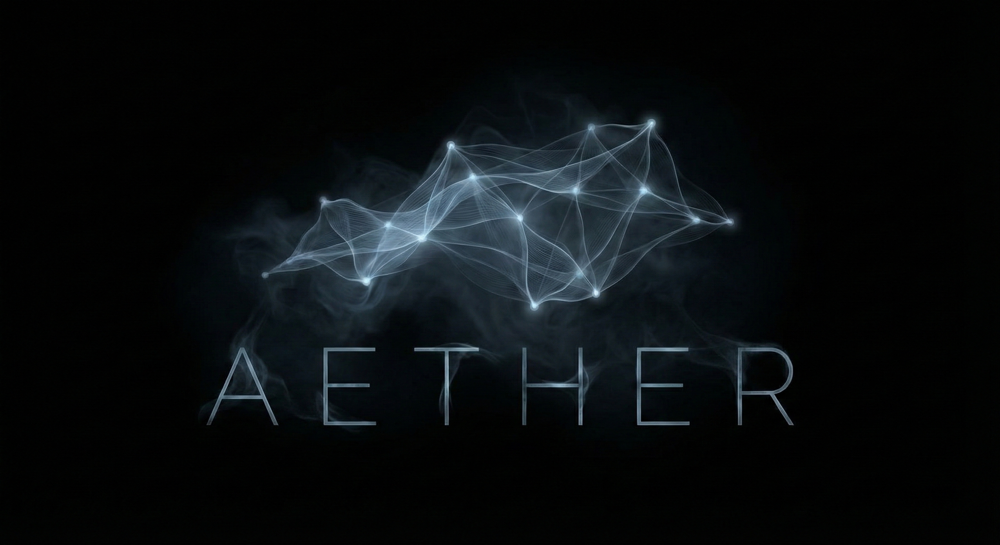
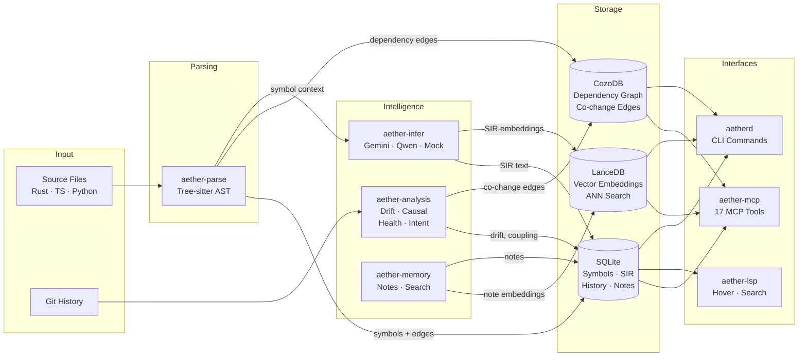
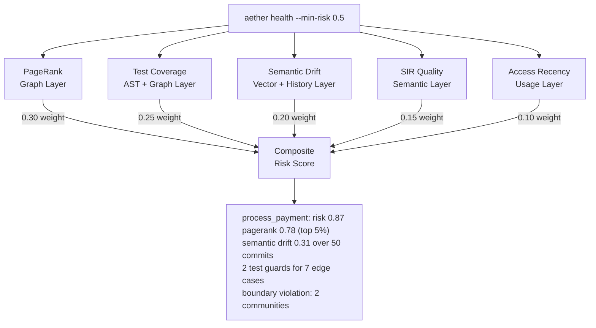
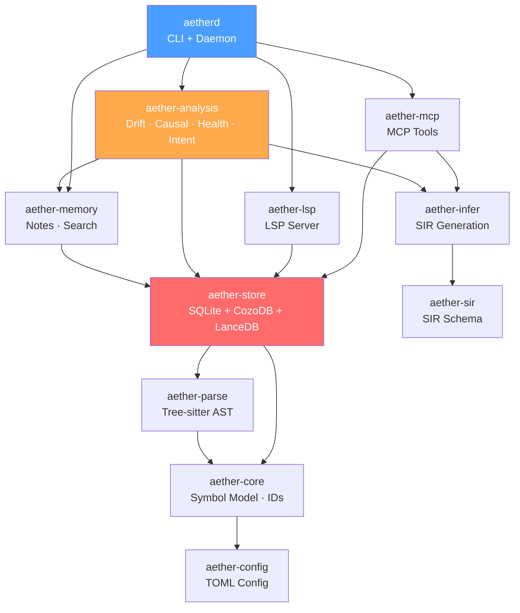

<p align="center">
  
</p>

<h1 align="center">AETHER</h1>
<p align="center"><strong>Active Semantic Simulation Engine</strong></p>
<p align="center">A verified, living graph of your codebase — not just searchable text.</p>

<p align="center">
  <a href="#quick-start">Quick Start</a> •
  <a href="#what-aether-does">What It Does</a> •
  <a href="#architecture">Architecture</a> •
  <a href="#mcp-tools">MCP Tools</a> •
  <a href="#cli-reference">CLI Reference</a> •
  <a href="#configuration">Configuration</a> •
  <a href="#development">Development</a>
</p>

---

> *"This function is the most critical in your codebase, changed meaning 3 times this month, has no test guards, and sits at a module boundary violation."*
>
> — That's the kind of answer AETHER gives.

Most code intelligence tools operate on one layer — text search, or static analysis, or git blame. AETHER operates on **five layers simultaneously** and fuses them into cross-layer queries that no existing tool can answer:

| Layer | Source | Example Query |
|-------|--------|---------------|
| **Structure** | Tree-sitter AST | "What calls `process_payment`?" |
| **Semantics** | AI-generated SIR summaries | "What does this function *mean*?" |
| **Dependencies** | CozoDB graph | "What's the blast radius if this breaks?" |
| **History** | Git + SIR versioning | "How has this function's purpose changed?" |
| **Similarity** | LanceDB vector search | "What other code does something similar?" |

AETHER watches your code, understands what it *means*, tracks how that meaning *changes*, and exposes that intelligence to both humans and AI agents through MCP tools, LSP hover, and a CLI.

## Quick Start

```bash
# Install from source
cargo install --path crates/aetherd

# Index your project
aether --workspace . --index

# Search for symbols
aether search "payment processing"

# Start the LSP + MCP server
aether --workspace . --lsp --mcp
```

### Give AI Agents Persistent Memory

Register AETHER as an MCP server for Claude Code, Codex, or any MCP-compatible agent:

```bash
# Claude Code
claude mcp add --transport stdio --scope project aether -- aetherd --workspace . --mcp

# Verify connection
claude mcp list

# Then ask your agent:
# "What does process_payment do?"
# "What upstream change most likely broke the order validation?"
# "Show me the health dashboard for the payments module"
# "Snapshot the intent of src/payments/ before I refactor"
```

## What AETHER Does

### Core Intelligence (Phases 1–4)

**Semantic Intent Records (SIR)** — AETHER doesn't just index your code; it *understands* it. For every function, struct, trait, and module, it generates a structured summary via Gemini Flash that captures purpose, parameters, return values, error modes, edge cases, and dependencies. These summaries are versioned, searchable, and diffable.

**Dependency Graphs** — Tree-sitter AST analysis extracts CALLS and DEPENDS_ON edges between symbols, stored in CozoDB as a queryable graph. This enables recursive traversal, community detection, cycle analysis, and PageRank — the foundation for everything in Phase 6.

**Hybrid Search** — Lexical search via SQL, semantic search via LanceDB vector embeddings, and Reciprocal Rank Fusion to combine results. Searches span symbols, project notes, test intents, and coupling data simultaneously.

**Git-Linked History** — Every SIR version is linked to the commit that triggered it. AETHER answers "what did this function do 20 commits ago?" and computes the semantic diff between any two versions.

### Project Intelligence (Phase 6 — The Chronicler)

Phase 6 transforms AETHER from code intelligence into *project* intelligence. These capabilities are what makes AETHER genuinely different — they only work because AST + SIR + graph + git + vectors all live in the same process:

**Project Memory** — Persistent storage for architecture decisions, design rationale, and session context. Agents `aether_remember` context and `aether_recall` it across sessions. Content-hash deduplication prevents bloat.

**Multi-Signal Coupling** — Detects logically coupled files by fusing three independent signals: git co-change frequency, AST dependency edges, and semantic SIR similarity. The fused score is more reliable than any single signal alone.

**Test Intent Extraction** — Parses test files to extract what each test guards (`it("should reject empty currency codes")`), creates TESTED_BY graph edges, and identifies symbols with inadequate test coverage relative to their SIR edge cases.

**Semantic Drift Detection** — Detects when a function's *meaning* is changing incrementally by comparing current SIR embeddings against historical baselines. Runs Louvain community detection on the dependency graph to flag architectural boundary violations — no manually maintained architecture model required.

**Causal Change Chains** — Traces the semantic causal chain backward through dependencies to find which upstream change most likely broke something. `git blame` tells you who changed a line; AETHER tells you *which upstream semantic change broke your downstream code and what specifically changed about it*.

**Graph Health Dashboard** — Applies CozoDB graph algorithms (PageRank, betweenness centrality, SCC, connected components, Louvain) to the dependency graph and cross-references with SIR quality, test coverage, drift magnitude, and access recency to produce composite risk scores per symbol.

**Intent Verification** — Snapshot SIR state before a refactor. After the refactor, verify which symbols preserved their original intent and which shifted — even when all tests pass. Tests verify *behavior*; AETHER verifies *intent preservation*.

## Architecture

### Data Flow



### Cross-Layer Query Fusion

This is what makes AETHER's architecture unique — a single query can traverse all five layers:



### Workspace Crates



### Storage Layers

| Layer | Technology | Contents |
|-------|-----------|----------|
| Relational | SQLite | Symbols, SIR blobs, SIR history, project notes, test intents, drift results, intent snapshots, coupling state |
| Graph | CozoDB | Dependency edges (CALLS, DEPENDS_ON), co-change edges, tested_by, community assignments |
| Vector | LanceDB | SIR embeddings, project note embeddings for ANN semantic search |

### Inference Providers

AETHER uses a pluggable provider system for SIR generation and embeddings:

| Provider | Use Case | Configuration |
|----------|----------|---------------|
| Gemini Flash | Cloud SIR generation (default) | `[inference] provider = "gemini"` |
| Qwen | Alternative cloud provider | `[inference] provider = "qwen3"` |
| Mock | Offline/testing, deterministic output | `[inference] provider = "mock"` |

## MCP Tools

AETHER exposes 17 MCP tools for AI agent integration:

### Core Tools
| Tool | Purpose |
|------|---------|
| `aether_symbol_lookup` | Find symbols by name or pattern |
| `aether_explain` | Get SIR-powered explanation of a symbol |
| `aether_get_sir` | Retrieve raw SIR JSON for a symbol |
| `aether_search` | Hybrid lexical + semantic search |
| `aether_why` | Show SIR diff between two versions of a symbol |

### Project Memory Tools
| Tool | Purpose |
|------|---------|
| `aether_remember` | Store a project note with deduplication |
| `aether_recall` | Search project notes by query |
| `aether_session_note` | Quick context capture during agent sessions |
| `aether_ask` | Unified search across all knowledge types |

### Analysis Tools
| Tool | Purpose |
|------|---------|
| `aether_blast_radius` | Multi-signal coupling analysis + risk assessment |
| `aether_test_intents` | Query test guards for a file or symbol |
| `aether_drift_report` | Semantic drift + boundary violation analysis |
| `aether_acknowledge_drift` | Dismiss known drift, create project note |
| `aether_trace_cause` | Causal change chain tracing for root cause analysis |
| `aether_health` | Graph health dashboard with composite risk scoring |
| `aether_snapshot_intent` | Capture SIR state before a refactor |
| `aether_verify_intent` | Compare SIR state after refactor for intent preservation |

## CLI Reference

### Indexing & Server

```bash
aether --workspace . --index                  # Index a project
aether --workspace . --lsp                    # Start LSP server
aether --workspace . --mcp                    # Start MCP server
aether --workspace . --index --lsp --mcp      # Combined mode
```

### Search & Query

```bash
aether search "payment validation" --limit 10           # Hybrid search
aether ask "what handles currency validation?" --limit 5 # Cross-type unified search
aether why <symbol_id> --from v1 --to v2                 # Semantic diff between versions
```

### Project Memory

```bash
aether remember "Chose CozoDB over KuzuDB — KuzuDB archived Oct 2025"
aether recall "graph storage decision"
aether notes --limit 20
```

### Analysis

```bash
# Coupling
aether mine-coupling --window "100 commits"
aether blast-radius src/payments/processor.rs
aether coupling-report

# Drift
aether drift-report --window "50 commits" --min-drift 0.15
aether drift-ack <result_id> --note "Intentional per ADR-23"
aether communities --format table

# Causal chains
aether trace-cause process_payment --file src/payments/processor.rs --lookback "20 commits"

# Health
aether health --limit 10 --min-risk 0.5
aether health critical | cycles | orphans | bottlenecks | risk-hotspots

# Intent verification
aether snapshot-intent --scope file --target src/payments/processor.rs --label "pre-refactor"
# ... do refactor ...
aether verify-intent snap_a1b2c3 --regenerate-sir
```

## Configuration

AETHER uses a TOML configuration file (`.aether/config.toml`):

```toml
[workspace]
root = "."
watch = true

[inference]
provider = "gemini"              # "gemini" | "qwen3" | "mock"
api_key_env = "GEMINI_API_KEY"

[embeddings]
provider = "gemini"
dimensions = 768

[search]
lexical_weight = 0.4
semantic_weight = 0.6

[drift]
enabled = true
drift_threshold = 0.85
analysis_window = "100 commits"
auto_analyze = false
hub_percentile = 95

[health]
enabled = true
[health.risk_weights]
pagerank = 0.3
test_gap = 0.25
drift = 0.2
no_sir = 0.15
recency = 0.1

[intent]
enabled = true
similarity_preserved_threshold = 0.90
similarity_shifted_threshold = 0.70
auto_regenerate_sir = true
```

## Development

### Prerequisites

- Rust (stable)
- mold linker + clang
- protoc (Protocol Buffers compiler)

### Build

```bash
git clone https://github.com/rephug/aether.git
cd aether

cargo build --workspace
cargo test --workspace
cargo fmt --all --check
cargo clippy --workspace -- -D warnings
```

### WSL2 Notes

If building on WSL2 with ≤16GB RAM, LanceDB's Apache Arrow compilation is memory-intensive. These settings prevent OOM crashes:

```bash
# In your shell profile or before building:
export CARGO_BUILD_JOBS=1
export CARGO_TARGET_DIR=~/aether-target    # NOT /tmp/ — that's RAM-backed in WSL2

# In C:\Users\<you>\.wslconfig:
[wsl2]
memory=8GB
swap=8GB
```

The mold linker (configured in `.cargo/config.toml`) also reduces peak memory during linking. Install with `apt install mold clang`.

### Crate Map

| Crate | Purpose |
|-------|---------|
| `aetherd` | CLI binary, daemon, command dispatch |
| `aether-core` | Symbol model, stable BLAKE3 IDs, diffing |
| `aether-config` | TOML configuration loading and validation |
| `aether-parse` | Tree-sitter AST parsing (Rust, TypeScript, Python) |
| `aether-sir` | SIR schema and validation |
| `aether-infer` | Inference provider abstraction (Gemini, Qwen, mock) |
| `aether-store` | SQLite + CozoDB + LanceDB storage layer |
| `aether-memory` | Project notes, session context, hybrid search |
| `aether-analysis` | Drift detection, causal chains, graph health, intent verification |
| `aether-lsp` | Language Server Protocol implementation |
| `aether-mcp` | Model Context Protocol tools for AI agents |

### Build Phases

| Phase | Codename | Focus |
|-------|----------|-------|
| 1 | **The Observer** | Indexing, SIR generation, search, LSP, MCP, VS Code extension, CI |
| 2 | **The Historian** | SIR versioning, git linkage, temporal "why" queries |
| 3 | **The Ghost** | Sandboxed execution environments *(planned)* |
| 4 | **The Architect** | LanceDB vectors, CozoDB graphs, native git via gix, dependency extraction |
| 5 | **The Cartographer** | Language plugin system, Python support, local embeddings |
| 6 | **The Chronicler** | Project memory, coupling, drift, causal chains, health, intent verification |

## Roadmap

| Area | What | Why |
|------|------|-----|
| **Local inference** | Candle on-device embeddings, Ollama local SIR generation | Fully air-gapped operation for classified or restricted codebases — zero cloud dependency |
| **Search quality** | Cross-encoder reranker, adaptive thresholds | Auto-tune drift and similarity thresholds per-project; improve precision on ambiguous queries |
| **Agent ecosystem** | `aether init-agent` integration kit | Scaffolds MCP registration, tool chains, and starter prompts for Claude Code, Codex, and custom agents |
| **Language expansion** | Go, Java, C# support | Via the Phase 5 language plugin system — same architecture, new grammars |

## License

See [LICENSE](LICENSE) for details.
