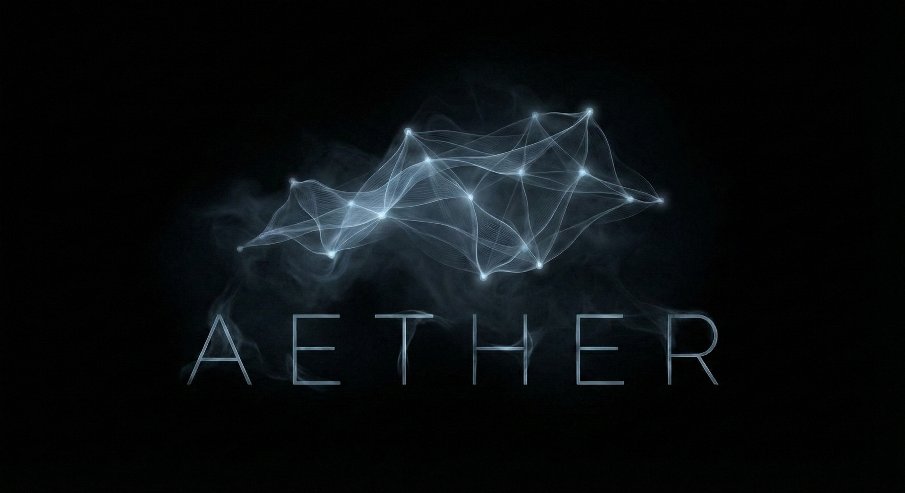

<p align="center">
  
</p>

<p align="center">
  <strong>Your codebase already knows everything. It just can't talk yet.</strong>
</p>

<p align="center">
  <a href="#what-the-hell-is-this">What Is This</a> •
  <a href="#get-it-running">Get It Running</a> •
  <a href="#what-you-can-actually-do">What You Can Do</a> •
  <a href="#the-mcp-tools">MCP Tools</a> •
  <a href="#the-dashboard">Dashboard</a> •
  <a href="#configuration">Config</a>
</p>

<p align="center">
  
  
  
</p>

---

## What the Hell Is This

AETHER is a semantic intelligence engine for codebases. It watches your code, figures out what every function *actually does*, tracks how that meaning changes over time, maps the dependency graph, and then lets you — or your AI agent — ask questions about it.

Not text search. Not grep with extra steps. Not another RAG tool that forgets everything between sessions.

AETHER *understands* your code. Persistently. Incrementally. And it remembers.

**Here's what that means in practice:**

You hover over a function in VS Code and instead of seeing a type signature, you see: *"Validates and processes a payment transaction. Deducts from account balance, writes to audit log. Can fail on insufficient funds, negative amounts, or database timeout. Has 7 edge cases, 2 of which have test coverage."*

You ask your AI agent "what broke the order validation?" and instead of guessing, it traces the causal chain through the dependency graph and tells you: *"validate_amount() changed its error type from String to ValidationError in commit abc123 — process_order() was pattern-matching on the old type."*

You open the dashboard and see which functions are the most critical nodes in your codebase, which ones are silently drifting in purpose, and which ones have zero test coverage despite sitting at a module boundary.

That's AETHER.

---

## How It Works (The Short Version)

```
Your code changes
       │
       ▼
  tree-sitter parses it
  (extracts every function, struct, trait, class + who calls what)
       │
       ▼
  An LLM reads each symbol and generates a SIR
  (Semantic Intent Representation — a structured summary of
   what the code does, how it fails, what it depends on)
       │
       ▼
  Everything gets stored in three databases
  SQLite (metadata) + SurrealDB (graph) + LanceDB (vectors)
       │
       ▼
  You query it however you want
  CLI  ·  LSP hover  ·  MCP tools  ·  Web dashboard
```

All of this runs locally. No code leaves your machine unless you choose a cloud provider. Run Ollama and AETHER works fully offline with real AI-generated intelligence — no API keys, no cloud calls, nothing phoning home.

---

## Get It Running

```bash
git clone https://github.com/rephug/aether.git
cd aether
cargo build -p aetherd -p aether-mcp -p aether-query
```

Index your project:

```bash
# One-shot: index everything and print what it found
aetherd --workspace /path/to/project --index-once --print-sir

# Watch mode: runs continuously, re-indexes on every save (300ms debounce)
aetherd --workspace /path/to/project --print-events --print-sir
```

Search it:

```bash
# Plain text search
aetherd --workspace . --search "authenticate"

# Semantic search (finds code by meaning, not just name)
aetherd --workspace . --search "handles user login flow" --search-mode semantic

# Hybrid (fuses both via Reciprocal Rank Fusion)
aetherd --workspace . --search "payment validation" --search-mode hybrid
```

Hook up your AI agent:

```bash
# Register as MCP server for Claude Code
claude mcp add --transport stdio --scope project aether -- aetherd --workspace . --mcp
```

Now your agent has persistent, structured access to your entire codebase's meaning. It doesn't have to re-read files every session. It doesn't have to guess. It *knows*.

---

## What You Can Actually Do

### Understand Any Symbol Instantly

Hover in VS Code. Run a CLI lookup. Ask via MCP. For every function, struct, trait, and class, AETHER gives you the full picture — intent, inputs, outputs, dependencies, error modes, edge cases, side effects, and a confidence score. These aren't docstrings scraped from comments. They're AI-generated structured annotations produced by actually reading the code.

### Search by Meaning, Not Just Text

`grep` finds text. AETHER finds *intent*. Search for "handles authentication" and get back every function involved in auth — even if none of them have "auth" in the name. Semantic search uses vector embeddings with per-language adaptive thresholds so Rust's tighter clustering doesn't drown out Python's looser naming conventions.

### See the Blast Radius Before You Touch Anything

Change a function? AETHER tells you every downstream symbol that depends on it, how many hops deep the impact goes, which of those symbols have test guards, and which ones are flying blind. Before you refactor, you know exactly what you're about to break.

### Detect Semantic Drift Automatically

Functions accumulate scope creep. What started as "checks amount is positive" quietly becomes "full payment validation with fraud checks, rate limiting, and compliance." AETHER detects this automatically by comparing current SIR embeddings against historical baselines. No manually maintained architecture model required — it runs Louvain community detection on the dependency graph and flags boundary violations on its own.

### Trace the Root Cause of Breaking Changes

`git blame` tells you who changed a line. AETHER tells you *which upstream semantic change broke your downstream code and what specifically changed about it*. It traces the causal chain backward through the dependency graph, comparing SIR versions at each node, until it finds the commit where the meaning diverged.

### Know Which Code Is Most Dangerous

Graph algorithms (PageRank, betweenness centrality, connected components) identify the most critical nodes in your codebase. Cross-reference that with test coverage, drift magnitude, and access recency and you get a composite risk score per symbol. The functions that are simultaneously high-traffic, poorly tested, and actively drifting? Those are the ones that will ruin your weekend.

### Remember Project Context Across Sessions

Architecture decisions, design rationale, "why we chose X over Y" — store it via MCP and recall it later. Your AI agent can `aether_remember` context and `aether_recall` it across sessions. Content-hash deduplication prevents bloat. Your agent no longer starts every conversation with amnesia.

### Verify Intent After Refactoring

Tests verify *behavior*. AETHER verifies *intent*. Snapshot the SIR state before a refactor, do the refactor, then compare. AETHER tells you which symbols preserved their original purpose and which ones shifted — even when all tests still pass.

### Find Coupled Code You Didn't Know Was Coupled

AETHER fuses three independent signals — git co-change frequency, AST dependency edges, and semantic SIR similarity — to detect logically coupled files. Two files that always change together, share dependencies, AND have similar semantics? They're coupled. The fused score is more reliable than any single signal alone.

### Know What Your Tests Actually Guard

AETHER parses test files to extract what each test is supposed to protect (`it("should reject empty currency codes")`). It creates `TESTED_BY` graph edges and identifies symbols with inadequate test coverage relative to their SIR-documented edge cases. Seven edge cases, two tests? You'll know.

---

## The Dashboard

A web-based visualization layer. HTMX + D3.js + Tailwind. No React. No Node.js. No build step. Just start the daemon and open your browser.

```bash
aetherd --workspace . --features dashboard
# → http://localhost:9720/dashboard
```

| Page | What It Shows |
|:-----|:-------------|
| **Overview** | Symbol counts, SIR coverage, language breakdown, system health at a glance |
| **X-Ray** | Hotspot analysis — which symbols are most critical by PageRank, churn, and risk |
| **Blast Radius** | Interactive graph showing the downstream impact zone when a symbol changes |
| **Architecture Map** | Force-directed dependency graph with Louvain community coloring |
| **Time Machine** | Semantic drift timelines — watch how symbol meanings evolve across commits |
| **Causal Explorer** | Trace breaking changes visually through the dependency chain |
| **Smart Search** | "Ask AETHER" — one search bar across symbols, notes, coupling, and test intents |

---

## The MCP Tools

Register AETHER with any MCP-compatible agent (Claude Code, Codex, etc.) and it gets structured access to everything. 20+ tools, zero guessing.

### Search & Lookup

| Tool | What It Does |
|:-----|:------------|
| `aether_status` | Workspace health — symbol count, SIR coverage, store paths |
| `aether_search` | Semantic / lexical / hybrid symbol search |
| `aether_symbol_lookup` | Find symbols by qualified name or file path |
| `aether_get_sir` | Full SIR annotation for any symbol |
| `aether_explain` | AI explanation of a symbol at a specific file:line:column |

### History

| Tool | What It Does |
|:-----|:------------|
| `aether_symbol_timeline` | SIR version history with git commit linkage |
| `aether_why_changed` | Semantic diff between any two SIR versions |
| `aether_verify` | Run verification commands, get structured results |

### Intelligence

| Tool | What It Does |
|:-----|:------------|
| `aether_remember` | Store a project note (decision, rationale, context) |
| `aether_recall` | Retrieve notes by semantic search |
| `aether_coupling` | Multi-signal coupling analysis for a file or symbol |
| `aether_test_intents` | Test guard coverage for a symbol |
| `aether_drift` | Semantic drift report for a symbol or module |
| `aether_causal_chain` | Root cause tracing through the dependency graph |
| `aether_blast_radius` | Downstream impact analysis |
| `aether_health` | Composite risk scores from graph algorithms |
| `aether_snapshot_intent` | Snapshot SIR state before a refactor |
| `aether_verify_intent` | Compare current SIR against a saved snapshot |

Every response includes `schema_version` for forward compatibility. Your agent scripts won't break when AETHER updates.

---

## VS Code Extension

Lives in `vscode-extension/`. Gives you semantic hover intelligence without leaving your editor.

```bash
cd vscode-extension && npm install && npm run build
# F5 to launch Extension Development Host
```

- **Hover** any Rust, TypeScript, or Python symbol → see its SIR summary
- **Status bar** shows `AETHER: indexing` / `idle` with stale/error indicators
- **Command palette**: Index Once, Search Symbols, Select Provider, Restart Server

---

## Configuration

Everything lives in `.aether/config.toml`, auto-created on first run.

```toml
[inference]
provider = "auto"              # auto | mock | gemini | ollama | openai_compat
api_key_env = "GEMINI_API_KEY"

[inference.openai_compat]
base_url = "https://api.z.ai/v1"
api_key_env = "ZAI_API_KEY"
model = "gemini-2.0-flash"

[embeddings]
enabled = true
provider = "qwen3_local"      # mock | qwen3_local | gemini

[search.thresholds]
default = 0.65
rust = 0.70
typescript = 0.65
python = 0.60

[dashboard]
enabled = true
port = 9720

[verify]
mode = "host"                  # host | container
commands = ["cargo test", "cargo clippy -- -D warnings"]
```

### Pick Your Intelligence Backend

| Provider | Needs | Good For |
|:---------|:------|:---------|
| `ollama` | Local Ollama server | Full offline intelligence (qwen2.5-coder:7b) — no API keys, no cloud |
| `gemini` | API key | Production-quality SIR (Gemini Flash) |
| `openai_compat` | API key + URL | Z.ai, NanoGPT, OpenRouter, or anything OpenAI-compatible |
| `mock` | Nothing | CI pipelines, testing, development — deterministic, instant |

`auto` tries `gemini` first, falls back to `ollama` if available, then `mock`.

---

## The Stack

For the curious:

| Thing | What |
|:------|:-----|
| Language | Rust (multi-crate workspace, ~15 crates) |
| Parsing | tree-sitter (Rust, TypeScript/JS, Python — more coming) |
| Graph DB | SurrealDB 3.0 + SurrealKV |
| Vector Store | LanceDB |
| Metadata | SQLite (WAL mode) |
| Local Embeddings | Qwen3-Embedding-0.6B via Candle |
| Reranking | Qwen3-Reranker-0.6B via Candle |
| Dashboard | HTMX + D3.js + Tailwind CSS (no build step) |
| HTTP | Axum + tower-http |
| MCP Transport | stdio (LSP) + HTTP/SSE (query server) |
| Git | gix (native Rust, no shelling out) |

---

## Why Not Just Use [Other Thing]?

| | grep / ctags | Copilot / Cursor | Augment Code | RAG tools | AETHER |
|:--|:------------|:-----------------|:-------------|:----------|:-------|
| Understands intent | Nope | Per-query, forgets immediately | Indexes repo, but no structured semantic model | Per-query, forgets immediately | Persistent, incremental, versioned SIR per symbol |
| Survives refactors | Byte offsets break | Embeddings go stale | Re-indexes, but no semantic diffing | Embeddings go stale | Semantic IDs via BLAKE3 |
| Works offline | Yes | No | No | Usually no | Yes — full local inference via Ollama |
| Tracks how meaning changes | No | No | No | No | Git-linked SIR versioning |
| Agent-accessible | No | Not really | Proprietary IDE only | Ad hoc context | 20+ structured MCP tools (any agent) |
| Detects drift | No | No | No | No | Automatic, zero config |
| Finds root causes | No | No | No | No | Causal chain graph traversal |
| Knows what's dangerous | No | No | No | No | PageRank + drift + test coverage |
| Open / extensible | Yes | No | No | Varies | Yes — open source, MCP-first |

---

## Contributing

```bash
# Build
cargo build --workspace

# Test (per-crate to avoid OOM on constrained machines)
cargo test -p aether-core
cargo test -p aether-parse
cargo test -p aether-store
cargo test -p aether-mcp
cargo test -p aetherd

# Lint
cargo fmt --all --check
cargo clippy --workspace -- -D warnings
```

---

<p align="center">
  <em>AETHER doesn't generate code. It makes sure you — and your AI — actually understand the code you already have.<br/>That's harder, and it matters more.</em>
</p>
